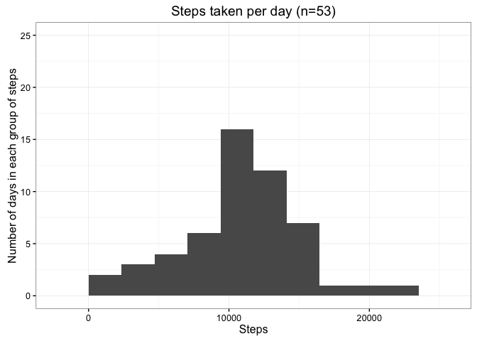
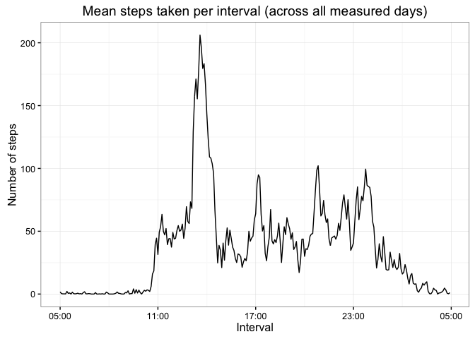
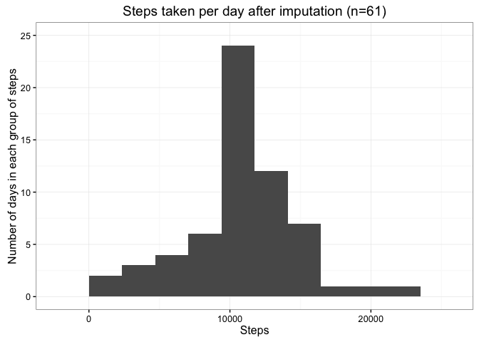
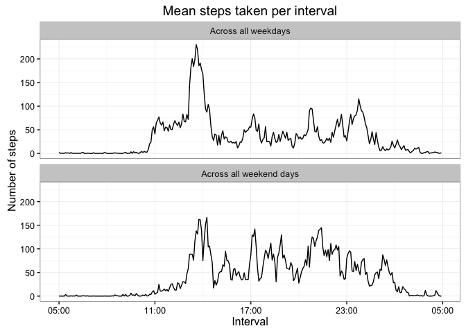

# Reproducible Research: Peer Assessment 1
David J. Weller-Fahy  
February 07, 2016  

Clear the environment for those times the chunks are run out of knitr.  Comment the following line out if you do not want any existing environment variables removed.


```r
rm(list=ls())
```

If you want to keep the unzipped data file after the run, then set `KEEP` to `T`.


```r
KEEP = F
```

Make sure the figures are placed in the correct directory.


```r
library(knitr)
knitr::opts_chunk$set(fig.path='figure/') # http://yihui.name/knitr/demo/minimal/
```

## Loading and preprocessing the data

Set the zip and data file names, and unzip the data file (if not already done).


```r
zfile = 'activity.zip'
cfile = 'activity.csv'
if (file.exists(zfile) & !file.exists(cfile))
  unzip(zfile, exdir = getwd())
```

Read in the data file and look at its structure.


```r
activity = read.csv(cfile)
str(activity)
```

```
## 'data.frame':	17568 obs. of  3 variables:
##  $ steps   : int  NA NA NA NA NA NA NA NA NA NA ...
##  $ date    : Factor w/ 61 levels "2012-10-01","2012-10-02",..: 1 1 1 1 1 1 1 1 1 1 ...
##  $ interval: int  0 5 10 15 20 25 30 35 40 45 ...
```

The structure inspires me to perform a trick.


```r
cat(activity$steps[1:8], intToUtf8(c(66, 65, 84, 77, 65, 78, 33)))
```

```
## NA NA NA NA NA NA NA NA BATMAN!
```

Robin would be so proud.  Regardless, onward with the questions.

## What is the mean total number of steps taken per day?

Sum the steps taken on each distinct date.  Note that some dates have no recorded steps: there are 61 distinct dates listed in the activity data, but only 53 have steps recorded for that date.


```r
daily = aggregate(steps ~ date, activity, sum, na.rm=T)
```

Display the distribution of the number of steps per day.  When considering how to label the histogram I found [this page][1] pretty useful.  I also (after creating the histogram for step 4) decided to keep the number of bins and y-axis limits the same for each, enabling easier comparison.

[1]: http://www.dummies.com/how-to/content/how-to-clearly-label-the-axes-on-a-statistical-his.html


```r
library(ggplot2)
library(scales)

histogram = function(df, var='steps', bins=nclass.FD(df[[var]]), title='Steps taken per day',
                     x.label='Steps', y.label='Number of days in each group of steps',
                     y.limits=c(0, 25)) {
  g = ggplot(df, aes_string(var)) +
    theme_bw() +
    geom_histogram(bins=bins) + #http://stats.stackexchange.com/a/862
    labs(title=paste(title, ' (n=', nrow(df), ')', sep='')) +
    scale_y_continuous(breaks=pretty_breaks(), limits=y.limits) + #http://stackoverflow.com/a/19512397
    labs(y=y.label, x=x.label)
  g
}

histogram(daily)
```



In calculating the mean and median the `daily` variable is used, which does not contain any of the `NA` values present in the data.


```r
mean.steps.per.day = mean(daily$steps)
mean.steps.per.day
```

```
## [1] 10766.19
```

```r
median.steps.per.day = median(daily$steps)
median.steps.per.day
```

```
## [1] 10765
```

## What is the average daily activity pattern?

Calculate the mean number of steps in each interval across all dates.


```r
mean.steps.per.interval = aggregate(steps ~ interval, activity, mean, na.rm=T)
```

Display the mean number of steps in each interval as a time series plot.  Remember to convert the intervals to actual times before plotting the time series ß([as noted here][noted]).

[noted]: https://www.coursera.org/learn/reproducible-research/discussions/cY3y58mbEeWx-RJXp8WlWQ


```r
time.series = function(df, var1='interval', var2='steps',
                       title=paste('Mean steps taken per interval',
                                   '(across all measured days)'),
                       x.label='Interval', y.label='Number of steps') {


  df[[var1]] = strptime(sprintf('%04d', df[[var1]]), '%H%M')

  g = ggplot(df, aes_string(var1, var2)) +
    theme_bw() +
    geom_line() +
    labs(title=title) +
    scale_x_datetime(date_labels='%H:%M') +
    labs(x=x.label, y=y.label)
  g
}

time.series(mean.steps.per.interval)
```



It looks like the interval with the greatest mean number of steps is close to 800, but let's find out exactly.


```r
with(mean.steps.per.interval, interval[which.max(steps)])
```

```
## [1] 835
```

```r
with(mean.steps.per.interval, steps[which.max(steps)])
```

```
## [1] 206.1698
```

So, the interval with the greatest mean number of steps is interval `835`, and its value is `206.1698` steps.

## Imputing missing values

As the missing values may introduce bias into some of the calculations or summaries, let's examine how many values are missing.


```r
sum(!complete.cases(activity))
```

```
## [1] 2304
```

Out of 17568 observations, there are 2304 that have missing data.  Which days have missing data?


```r
dates.with.missing = unique(activity[!complete.cases(activity), ]$date)
dates.with.missing
```

```
## [1] 2012-10-01 2012-10-08 2012-11-01 2012-11-04 2012-11-09 2012-11-10
## [7] 2012-11-14 2012-11-30
## 61 Levels: 2012-10-01 2012-10-02 2012-10-03 2012-10-04 ... 2012-11-30
```

Eight of the dates have missing values.  How many of the dates with missing values have any data?


```r
subset(activity, complete.cases(activity) & date %in% dates.with.missing)
```

```
## [1] steps    date     interval
## <0 rows> (or 0-length row.names)
```

Zero.  As none of the dates with missing values have any values at all, the missing value for a given interval will be filled by using the average of that interval across all the dates.


```r
activity.imputed = activity
na.idx = which(is.na(activity$steps))
match.idx = match(activity[na.idx, ]$interval, mean.steps.per.interval$interval)
activity.imputed[na.idx, ]$steps = mean.steps.per.interval[match.idx, ]$steps
str(activity.imputed)
```

```
## 'data.frame':	17568 obs. of  3 variables:
##  $ steps   : num  1.717 0.3396 0.1321 0.1509 0.0755 ...
##  $ date    : Factor w/ 61 levels "2012-10-01","2012-10-02",..: 1 1 1 1 1 1 1 1 1 1 ...
##  $ interval: int  0 5 10 15 20 25 30 35 40 45 ...
```

Sum the steps taken on each distinct date after imputing the data.  Note that the intervals that have no recorded steps have been replaced with the mean for that interval across dates, so there will be 61 distinct dates instead of 53.


```r
daily.imputed = aggregate(steps ~ date, activity.imputed, sum, na.rm=T)
```

Display the distribution of the number of steps taken per day (after imputation).  The number of bins and y limits are set the same as the previous historgram to enable easier comparison.


```r
histogram(daily.imputed, bins=nclass.FD(daily$steps),
          title='Steps taken per day after imputation')
```



In calculating the mean and median the `daily.imputed` variable is used, which contains no NA values at all.


```r
mean.imputed.steps.per.day = mean(daily.imputed$steps)
mean.imputed.steps.per.day
```

```
## [1] 10766.19
```

```r
median.imputed.steps.per.day = median(daily.imputed$steps)
median.imputed.steps.per.day
```

```
## [1] 10766.19
```

Did imputing the data make any difference in the calculated mean and median?  The value of `mean.steps.per.day` is  equal to the value of `mean.imputed.steps.per.day`.  The value of `median.steps.per.day` is **not** equal to the value of `median.imputed.steps.per.day`.  These results make sense, as replacing missing values with the mean number of steps per interval across dates will not change the mean, but it *will* change the number of values that take the value of the mean, and thus the median.

This is seen clearly on the histograms as the distribution itself does not shift, only the center bin (with the mean values) grows significantly.

## Are there differences in activity patterns between weekdays and weekends?

To answer this question a factor variable is needed to differentiate between the weekdays and weekend days.


```r
activity.imputed$date.type =
  as.factor(ifelse(strftime(activity.imputed$date, '%u') < 6,
         'weekday', 'weekend'))
```

Calculate the mean number of steps per interval across each date type (`weekday` and `weekend`).


```r
mean.imputed.steps.per.interval.date.type =
  aggregate(steps ~ interval + date.type, activity.imputed, mean, na.rm=T)
```

Display the mean number of steps after imputation in each interval across each date type as a time series plot.


```r
date.type.labeller = function(x) {
  x$date.type = c('Across all weekdays', 'Across all weekend days')
  x
}
g = time.series(mean.imputed.steps.per.interval.date.type,
                title='Mean steps taken per interval') +
  facet_wrap(~date.type, dir='v', labeller=date.type.labeller)
g
```



Clean up after ourselves.


```r
if (!KEEP) {
  unlink(cfile)
}
```
